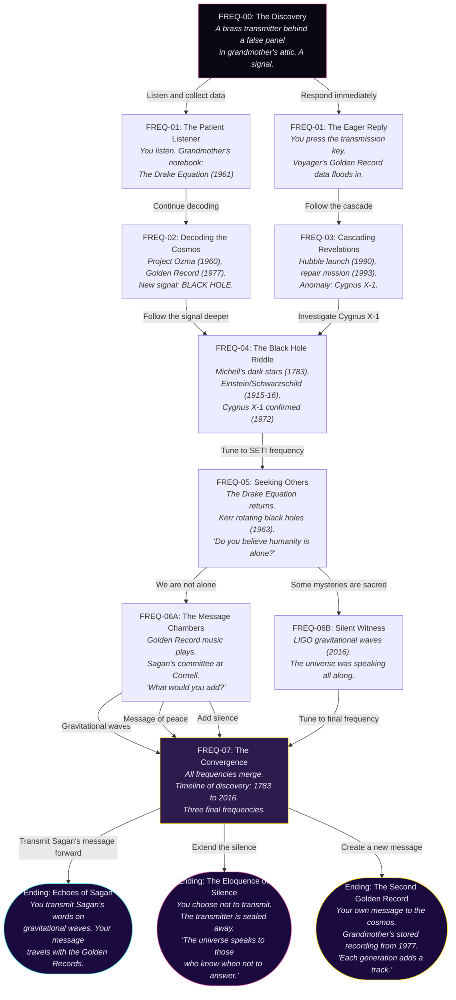

# The Golden Record — Story Flow

> **Theme:** Cosmic | **Voice:** Carl Sagan | **Setting:** Grandmother's attic / the cosmos

## Mermaid Flowchart



## Story Statistics

| Metric | Count |
|--------|-------|
| Total scenes | 11 |
| Choice points | 5 |
| Endings | 3 |
| Historical facts | 14 |
| Linear scenes (single choice) | 4 |

## Story Structure

The Cosmic story has a **diamond shape** — it splits into two paths (Eager/Patient) early on, each path has 1-2 linear scenes, then they **converge** at the Black Hole Riddle. It splits again briefly (Message/Witness), then converges at the final Convergence scene before fanning into 3 endings.

```
        Discovery
       /         \
    Eager      Patient
      |           |
   Cascade     Decode
       \         /
      Black Hole Riddle
            |
         Seeking
        /       \
   Message    Witness
       \         /
      Convergence
      /    |     \
  Hopeful Mystery Creative
```

## Endings Summary

| Ending | Tone | What happens |
|--------|------|--------------|
| Echoes of Sagan | Hopeful | Transmit Sagan's words on gravitational waves into the cosmos |
| The Eloquence of Silence | Contemplative | Seal the transmitter away; preserve the mystery |
| The Second Golden Record | Personal | Add your own voice; discover grandmother's 1977 recording |

## Historical Facts Timeline

| Year | Discovery |
|------|-----------|
| 1783 | John Michell theorizes "dark stars" (proto-black holes) |
| 1915 | Einstein publishes General Relativity |
| 1916 | Schwarzschild calculates event horizon radius (from WWI trenches) |
| 1946 | Lyman Spitzer Jr. proposes a space telescope |
| 1960 | Frank Drake conducts Project Ozma (first SETI search) |
| 1961 | Frank Drake formulates the Drake Equation |
| 1963 | Roy Kerr solves rotating black hole equations |
| 1972 | Cygnus X-1 confirmed as first black hole candidate |
| 1977 (Aug) | Voyager 2 launches with Golden Record |
| 1977 (Sep) | Voyager 1 launches with Golden Record |
| 1990 | Hubble Space Telescope deployed (flawed mirror) |
| 1993 | Shuttle Endeavour repairs Hubble with COSTAR optics |
| 2016 | LIGO detects gravitational waves (GW150914) |
