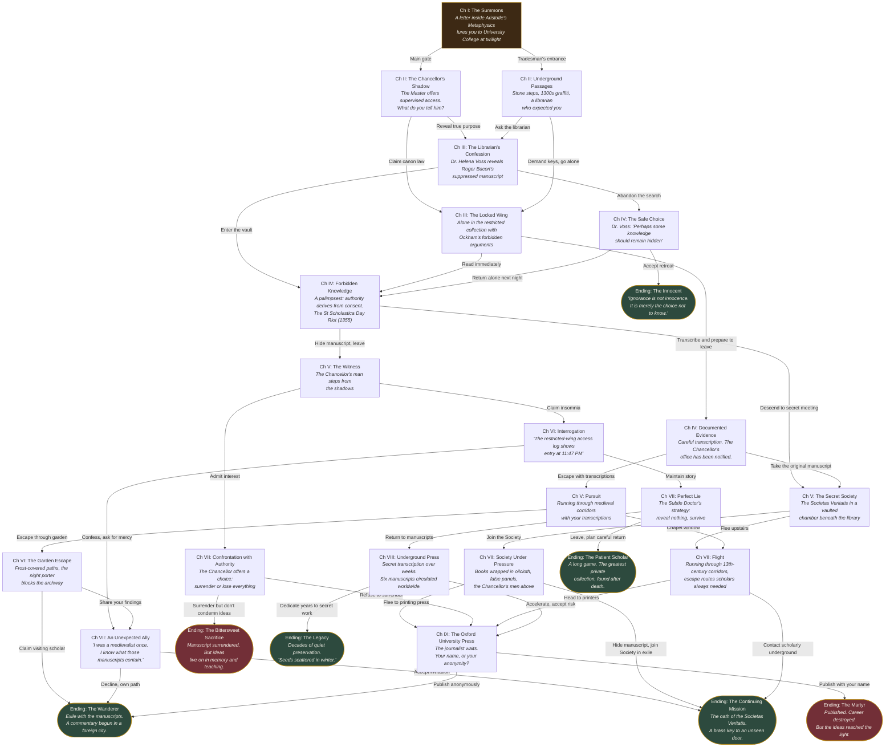

# The Forbidden Library — Story Flow

> **Theme:** Dark Academia | **Voice:** James Earl Jones | **Setting:** Oxford, England

## Mermaid Flowchart

## Story Statistics

| Metric | Count |
|--------|-------|
| Total scenes | 19 |
| Choice points | 17 |
| Endings | 7 |
| Historical facts | 12 |
| Chapters | I through IX + Epilogue |

## Endings Summary

| Ending | Tone | Path flavor |
|--------|------|-------------|
| The Innocent | Melancholy | Retreat from forbidden knowledge |
| The Wanderer | Bittersweet | Exile with manuscripts, commentary abroad |
| The Continuing Mission | Hopeful | Join the Societas Veritatis |
| The Martyr | Defiant | Public exposure, career destroyed |
| The Bittersweet Sacrifice | Resigned | Surrender manuscript, teach ideas from memory |
| The Legacy | Triumphant | Decades of secret preservation |
| The Patient Scholar | Quiet triumph | Long game, collection found posthumously |

## Historical Facts Timeline

| Year | Fact |
|------|------|
| 1096 | Teaching documented at Oxford |
| 1167 | Henry II bans English students from Paris; Oxford grows to 3,000 |
| 1209 | Two students murdered; scholars flee, some found Cambridge |
| 1214 | Oxford Ordinance grants Chancellor authority above town |
| 1249 | University College founded (William of Durham's 310 marks) |
| 1263 | Balliol College founded by John I de Balliol |
| 1266-1308 | Duns Scotus ("Doctor Subtilis") at Oxford |
| 1277-1279 | Roger Bacon imprisoned for "suspected novelties" |
| c. 1287-1347 | William of Ockham's nominalism; charged with heresy, exiled |
| 1355 | St Scholastica Day Riot (63 scholars, 20 townspeople killed) |
| c. 1750 | Flat Hat Club — oldest documented secret society |
| 1559-1966 | Index of Prohibited Books |
